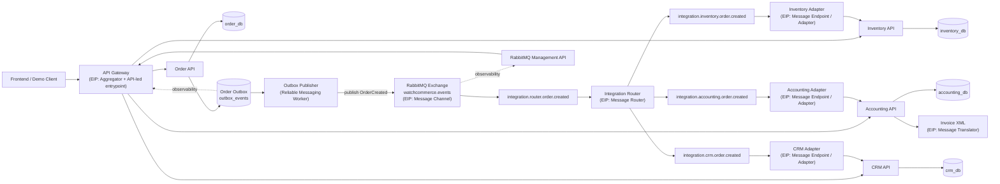

# Integration Architecture

## Komponen Utama

- `order-api` adalah source of truth untuk checkout dan canonical event `OrderCreated`.
- `outbox_events` menyimpan event canonical secara transaksional bersama data order.
- `order-outbox-publisher` bertanggung jawab mem-publish event dari outbox ke RabbitMQ dan memperbarui status `pending`, `published`, atau `failed`.
- `integration-router` memisahkan concern routing dari service bisnis.
- Adapter layer menjaga agar service bisnis tetap fokus pada logic domain dan tidak perlu menjadi consumer broker langsung.
- `api-gateway` menyediakan endpoint bisnis untuk client sekaligus observability agregat untuk admin/demo.

## EIP yang Terlihat di Diagram

| EIP | Letak Implementasi |
|---|---|
| Message Channel | Exchange dan queue RabbitMQ |
| Message Router | `integration-router` |
| Message Endpoint | `order-api`, adapter services |
| Adapter | `inventory-adapter`, `accounting-adapter`, `crm-adapter` |
| Message Translator | `accounting-api` mengubah JSON event menjadi XML invoice |
| Aggregator | `api-gateway` untuk overview dan observability |
| Canonical Data Model | payload `OrderCreated` |

## Alur Checkout Normal

1. Client memanggil `POST /api/orders/checkout` melalui gateway.
2. `order-api` menyimpan `orders`, `order_items`, dan satu record `outbox_events` dalam satu transaksi database.
3. `order-outbox-publisher` membaca outbox dan mem-publish canonical `OrderCreated` ke exchange RabbitMQ.
4. `integration-router` menerima event canonical dan mendistribusikan ke tiga queue adapter.
5. Setiap adapter memanggil internal API service target.
6. Inventory membuat reservation stok, accounting membuat invoice XML, dan CRM membuat purchase history.
7. `api-gateway` dan frontend admin menampilkan hasil sinkronisasi dan status observability.

## Alur Reliable Messaging

1. Jika broker mati saat checkout, transaksi order tetap sukses karena data order dan outbox sudah aman di `order_db`.
2. Publisher worker mencoba publish dengan retry terbatas dan backoff sederhana.
3. Jika broker pulih sebelum retry habis, event akan otomatis berubah ke status `published`.
4. Jika retry habis, event ditandai `failed` dan dapat direqueue melalui `POST /api/orders/outbox/{event_id}/retry`.
5. Downstream service tetap idempotent berdasarkan `order_id`, sehingga replay tidak menggandakan side effect.

## Bukti Loose Coupling

- `order-api` hanya mengakses `order_db`.
- `inventory-api` hanya mengakses `inventory_db`.
- `accounting-api` hanya mengakses `accounting_db`.
- `crm-api` hanya mengakses `crm_db`.
- Komunikasi lintas domain selalu melalui message broker dan internal API, bukan SQL lintas service.

## Jalur Observability

- Gateway membaca health tiap service.
- Gateway membaca summary dan recent events dari endpoint outbox order.
- Gateway membaca statistik queue dari RabbitMQ Management API.
- Frontend admin menampilkan service health, queue topology, outbox pipeline, dan latest downstream synchronization.
