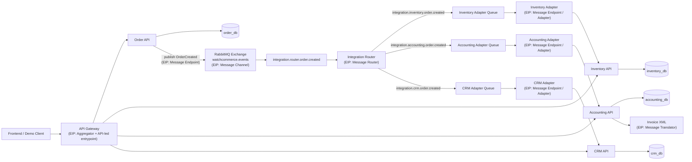

# Integration Architecture

## Komponen
- `order-api` adalah producer canonical event `OrderCreated`.
- `integration-router` menjadi consumer tunggal untuk routing event canonical.
- Adapter layer bertanggung jawab menerjemahkan message broker menjadi HTTP call ke service bisnis.
- `api-gateway` menggabungkan response dari beberapa service untuk kebutuhan admin/demo.

## Bukti Tidak Ada Cross-DB Access
- `order-api` hanya terhubung ke `order_db`.
- `inventory-api` hanya terhubung ke `inventory_db`.
- `accounting-api` hanya terhubung ke `accounting_db`.
- `crm-api` hanya terhubung ke `crm_db`.
- Side effect antar domain selalu melalui `RabbitMQ -> Router -> Adapter -> HTTP API`.
